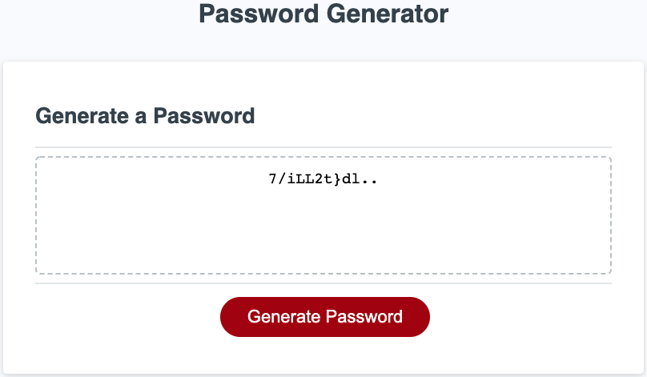

# Homework 3: Password Generator #
Password Generator - Jae Ahn

This is a browser application that enables users to generate random passwords based on criteria that they have selected.  The password generation process will begin once the user clicks on the *Generate Password* button.  Once this button is clicked, the user will be presented with a series of prompts for password criteria.  These criteria include:
* Desired character length (8-128 characters)
* Uppercase letters (A, B, C...)
* Lowercase Letters (a, b, c...)
* Numbers (1, 2, 3...)
* Special Characters (!, @, #...)

After the user selects the criteria for their password, the application will randomly generate a password matching the user's selected criteria and display it in the text box.

In creating this application, many JavaScript tools were utilized.  These include:
* Variables
* Arrays
* Functions
* Methods
* If, else if, and else statements
* For loops
* Event listeners

Link to Deployed Application
---------------
[Password Generator](https://ahnjaeyung.github.io/Homework_3_Password_Generator/)